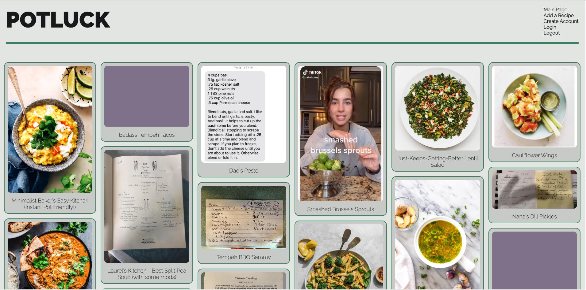
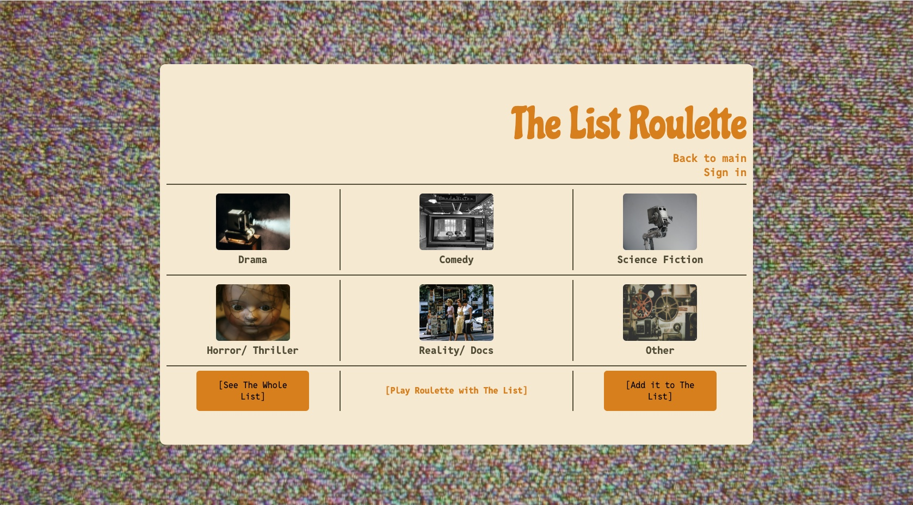
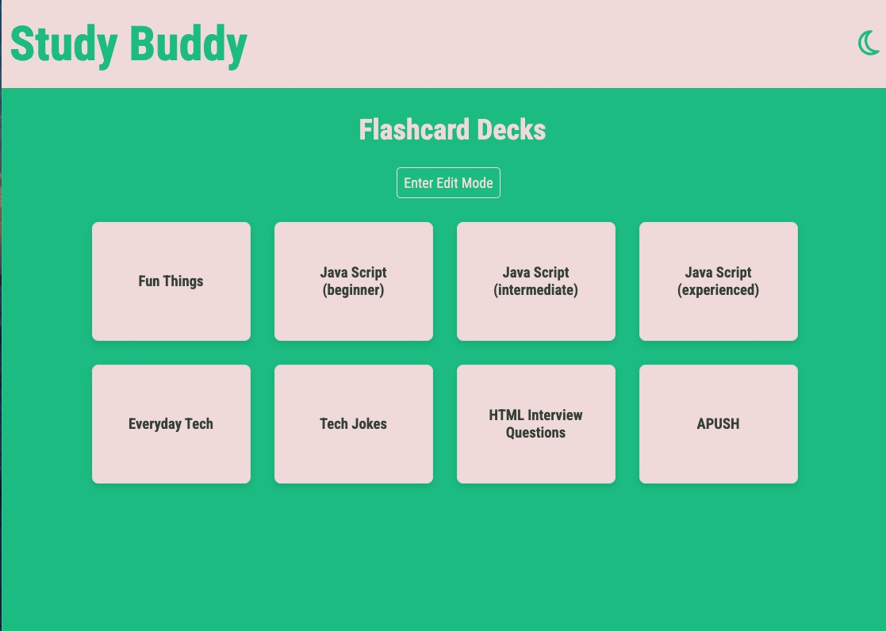

# Mackenzie Wicker

### 🌐 linkedin.com/in/mackenziewicker

## Introduction

I am a full-stack software engineer with a background in award-winning communications and a drive to build eye-catching software that helps people live easier, more meaningful lives.

I grew up in an artistic household that prioritized curiosity, introspection, and play, and I’m committed to examining what it means to be my best self alone, in relationships, and in my communities. My desire to contribute to the betterment of those communities – and the world – inspired my work in journalism and local government. It’s a principle I continue to hold dear.

However, as my career transitioned to focus solely on communications, I realized I wanted to do something more challenging that stretched my brain on a daily basis. Friends in tech would tell me about projects they were working on and it sounded so much more interesting than the work I was doing.

So I took the leap into a coding bootcamp and I loved it. In software development, I have found the opportunity to be creative, solve complex problems, and continuously learn that I’ve been looking for. I’m excited about building products that encourage community engagement; informed, intentional living; connection; and joy.

## Portfolio

### **[Potluck](https://potluck.onrender.com/)**

- [Deployed on Render](https://potluck.onrender.com/)
- An app for keeping track of recipes in lots of different formats.
- **Built with:** JavaScript, MongoDB, Mongoose, Express, Node, BCrypt

### **[Pause](https://takeapause.netlify.app/)**

- [Deployed on Netlify](https://takeapause.netlify.app/)
- A simple meditation app. Time your session, log how you felt before and after, and journal about any thoughts that came up.
- **Built with:** React, TypeScript, Express, Node, PostgreSQL, Prisma, Clerk

### **[The List Roulette](https://thelistroulette.netlify.app/)**

- [Deployed on Netlify](https://thelistroulette.netlify.app/)
- A quirky web app for managing TV shows and movies you told people you would watch. Create an account to add stuff to your list, then search by genre or use the roulette function when you can't decide what to watch.
- **Built with:** React, Python, Django/REST Framework, PostgreSQL, Clerk

### **[Study Buddy](https://deluxe-trifle-0b2556.netlify.app/)**

- [Deployed on Netlify](https://deluxe-trifle-0b2556.netlify.app/)
- **Note:** This site's backend is deployed on Render's free tier and somewhat slow to load.
- A full CRUD app to help you study. Create flashcard decks to quiz yourself on any topic.
- **Built with:** React, MongoDB, Mongoose, Express, Node

## Skills

♦ **Languages:** JavaScript, TypeScript, Python

♦ **Frontend**: HTML, CSS, React

♦ **Backend**: Express, Node, Django

♦ **Database**: Mongo, PostgreSQL, SQLite

♦ **Other:** jQuery, EJS, JSX, Mongoose, Prisma, RESTful APIs, JSON, MVC architecture, VSCode, Git, GitHub, WordPress, Elementor, Slack, Constant Contact, MailChimp, Canva, Presto, Google Suite products, Microsoft Office (including Teams), Zoom, Trello, Wrike
